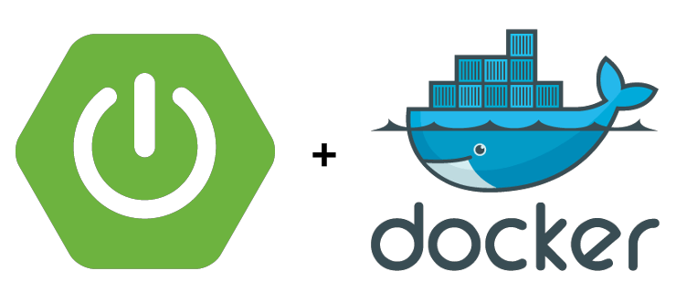
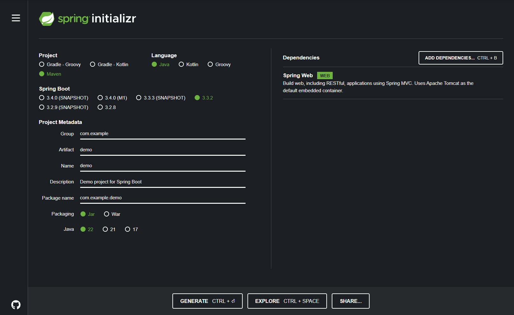
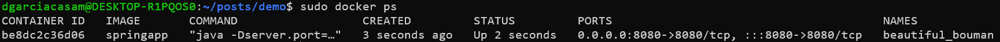

## Introducción

El ciclo de vida del software está compuesto de muchas fases. Una parte crucial de este es el despliegue. De nada sirve construir una aplicación si a la hora de la verdad no podemos acceder a ella y utilizarla fuera de nuestro entorno de desarrollo. El despliegue no solo garantiza que nuestra aplicación esté disponible para los usuarios finales, sino que también permite su escalabilidad y mantenimiento en un entorno de producción.

En los últimos años, Docker se ha convertido en una herramienta esencial para el despliegue de aplicaciones debido a su capacidad para crear entornos consistentes y portátiles. Docker permite empaquetar una aplicación junto con todas sus dependencias en un contenedor, asegurando que se ejecute de la misma manera en cualquier entorno.

Además, la mayoría de hostings suelen tener una serie de frameworks y lenguajes que aceptan de forma predeterminada aunque mucho también tienen la opción de desplegar proyectos en el lenguaje que prefieras mediante el uso de Dockerfiles. Por lo que saber utilizar esta herramienta nos abre un gran abanico de posibilidades donde desplegar nuestras aplicaciones.



Al final de esta guía, tendrás los conocimientos necesarios para desplegar tu aplicación Java Spring Boot en un entorno de Docker, asegurando un proceso de despliegue eficiente y robusto.

## Proyecto

El proyecto que utilizaremos será un proyecto básico Java Spring Boot con Maven al que le he añadido las depedencias de Spring Boot Web para poder crear una API de forma rápida y sencilla.

#### Configuración del proyecto:



#### Estructura de carpetas y endpoint:

```
    📁com.example.demo
        📁controllers
         ├── TestController.java
```

#### TestController.java

```java
package com.example.demo.controllers;

import org.springframework.http.ResponseEntity;
import org.springframework.stereotype.Controller;
import org.springframework.web.bind.annotation.GetMapping;
import org.springframework.web.bind.annotation.RequestMapping;

@Controller
@RequestMapping("/test")
public class TestController {

    @GetMapping
    public ResponseEntity<String> test(){
        return ResponseEntity.ok("El proyecto se ha desplegado correctamente");
    }
}
```

Una vez que tenemos el endpoint podríamos ejecutar la aplicación, ir a [localhost](http://localhost:8080/test) y veríamos el siguiente mensaje en pantalla:


## Instalación de Docker

Instalamos la interfaz de línea de comandos de Docker. Si lo prefiriéramos, podríamos instalar Docker Desktop para tener el programa de forma visual, aunque en mi caso no será necesario.

```bash
# Instalamos Docker
sudo npm install apt-get install docker-ce docker-ce-cli

# Comprobamos la versión del CLI de Docker
docker --version

# Comprobamos que el servicio se está ejecutando
sudo systemctl status docker
```

## Configuración del Dockerfile y ejecución

En la raíz del proyecto creamos un archivo Dockerfile. Es importante que la primera letra vaya en mayúscula ya que este archivo podrá ser ejecutado desde Ubuntu, el cual distingue entre mayúsculas y minúsculas.

Este Dockerfile se utiliza para construir y ejecutar una aplicación Java en dos etapas: primero compila y empaqueta la aplicación utilizando el JDK, luego prepara una imagen más ligera para la ejecución con el JRE, configurando el puerto y usando un usuario no root para mayor seguridad.

#### Dockerfile:

```dockerfile
# Utilizamos una imagen del JDK22 para compilar el mismo
FROM eclipse-temurin:22-jdk AS build

# Copiamos el código fuente al directorio /app
COPY . /app

# Establecemos el directorio de trabajo
WORKDIR /app

# Compilamos el proyecto generando un archvio JAR en el directorio target
RUN ./mvnw package -DskipTests
# Movemos este archivo modificando el nombre a app.jar
RUN mv -f target/*.jar app.jar

## Utilizamos una imagen del entorno de ejecución de Java para ejecutar el proyecto
FROM eclipse-temurin:22-jre

# Definimos un argumento y una variable de entorno que se pasará al construir la imagen
ARG PORT
ENV PORT=${PORT}

# Copiamos el archivo JAR que hemos generado anteriormente
COPY --from=build /app/app.jar .

# Creamos un usario con el que se ejecutarán los siguientes comandos
RUN useradd runtime
USER runtime

# Definimos el comando que se ejecutará al inicar el contenedor
ENTRYPOINT [ "java", "-Dserver.port=${PORT}", "-jar", "app.jar" ]
```

Una vez creado este archivo, podemos ir a la carpeta, construir la imagen de Docker a partir de nuestro archivo Dockerfile y ejecutar el contenedor Docker.

```bash
# En la carpeta del proyecto
# Pasamos el argumento PORT y etiquetamos la imagen con el parámetro -t
sudo docker build --build-arg PORT=8080 -t springapp .

# Una vez construida la imagen de docker podemos ejecutar el contenedor
# Mapeamos el puerto 8080 del contenedor al puerto 8080 de la máquina host
sudo docker run -d -p 8080:8080 springapp

# Comprobamos que el contenedor se está ejecutando
sudo docker ps
```

El último comando nos debería devolver algo similar a esto:


Y si hemos hecho todo bien y volvemos a [localhost](http://localhost:8080/test) veremos el mensaje de nuestro endpoint:


## Conclusión final

Como he comentado, muchos hostings admiten Docker para poder subir aplicaciones en el lenguaje que queramos, por lo que tener unos conocimientos mínimos de Docker es algo que nos puede ayudar mucho, sobre todo a la hora de desplegar nuestras aplicaciones. Evidentemente, esto es un ejemplo muy simple, ya que en una aplicación real tendríamos varios servicios, una base de datos y muchos más elementos, por lo que debemos conectar correctamente los contenedores para que puedan comunicarse entre sí.
